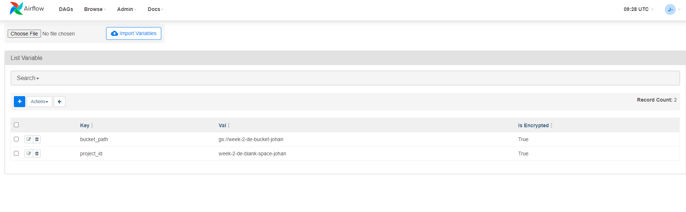

# Week 2 : Data Integration Using Airflow Dataflow and BigQuery In GCP Composer

 

In previous week, I learn how to use Airflow localy, using data that given to me.  
This week, I tried to set Airflow in Google Cloud Platform Environment using Google Composer. It's actually a very powerfull tools to use so that all we need to do is choose the image we want to use in the google composer.

### Requirements 

- First thing to do is to create Google Cloud Platform Account. Usually, in Indonesia we use Jenius as our credit card to create this account. You just have to deposit some money into your Jenius account but don't worry! This is completely free. Even you got $300 USD or Rp. 4.300.000,00 balance for the sake of learning in GCP Environment 

### Installation 
- Create a project and you can give it any name with certain regulation 
- Create service account for your GCP. You will receive credential keys for many purpose. One of the purpose is to connect the data inside your storage to other's data so that it can integrated. To create service account, please follow the steps <a href='https://cloud.google.com/iam/docs/creating-managing-service-accounts'> how to create google service account</a> 
- Create a google cloud storage, create a folder (bucket) and upload the data needed there
- Create a composer with this details :
  - Location :  us-central1
  - Zone : us-central1
  - Node count : 3
  - Disk size (GB) : 20
  - Machine type : n1-standard-1
  - Cloud SQL machine type : db-n1-standard-2 (2 vCPU, 7.5 GB memory)
  - Web server machine type : composer-n1-webserver-2 (2 vCPU, 1.6 GB memory) 
 US has the cheapest cost for running an environment.
 
 ### How to Use 
- Upload the data to your bucket (GCS)
- Open google composer, and click `Airflow Server` and `DAG`
- Place your DAG into the folder `DAG` inside airflow bucket. <b> Note : Airflow bucket only for Airflow components only </b>
- Fill your variables in the Airflow UI by clicking Admin and then Variables.
- Change `bucket_path` and `project_id` as per your project and path name  

- Monitor your process trough Airflow UI

 

### Script Explanation  
1. Task 1 :  
A.Given 6 csv's file consist of keyword search and the number of it's keyword is searched. 
Create empty table inside BigQuery using DataFlow. You can follow the process <a href='https://cloud.google.com/composer/docs/how-to/using/using-dataflow-template-operator'> here</a>. To perform this task, I am using DataflowTeplateOperator as written in the template 
To create these, a schema.json that tells GCP how to read the csv file per line is created  
Result for no 1A: 

B. Create new table inside BigQuery to return table consist of most keyword search in daily  
To process it, need to do a simple SQL query to return most search keyword and place it into our bigquery dataset. To perform this task, I am use BigQueryOperator 
Result for no 1B: 

2. Task 2 :  
Given a bigquery table in another account's GCP that shared to us that consist of some fields with nesting field as one of it. 
We asked to return these bigquery table to our dataset to take some important fields only. 
To perform it, I am using BigQueryOperator and some SQL query, and return it into our project. The output of this task is a bigquery table inside our GCP account 
Result for no 2: 

Thankyou and Happy Coding
